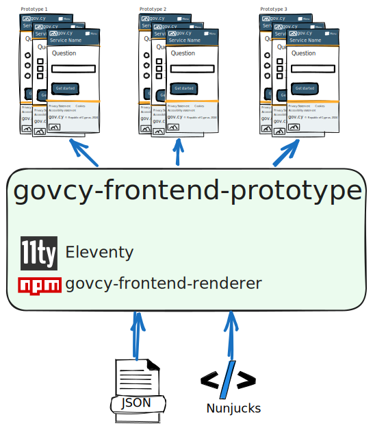

# govcy-frontend-prototype

This project is called `govcy-frontend-prototype` and its purpose is to build prototypes of gov.cy services and websites using the [Unified Design System of gov.cy](https://gov-cy.github.io/govcy-design-system-docs/) without coding. 



The project is not intended to be used for production purposes.

## Use cases
It's been build so that we could: 
- Perform user research with a near real prototype
- Showcase a gov.cy service to stakeholders
- Help the design team understand how the end product will look like
- Help developers to see how HTML elements are rendered through the [Unified Design System developed assets](https://gov-cy.github.io/govcy-design-system-docs/getting-started/developer-assets/)
- Test new design system components
- Validate compliance with accessibility standards and guidelines early in the design process
- Showcase the use of the [govcy-frontend-renderer](https://www.npmjs.com/package/@gov-cy/govcy-frontend-renderer)

It can be used for a wide range of use cases, such as:
- Test and iterate on new service designs before committing to production development
- Demonstrate the functionality and flow of a service for internal training or onboarding
- Quickly create mockups for presentations, workshops, or stakeholder meetings
- Collaborate with cross-functional teams by providing a tangible reference for discussions
- Compare alternative design solutions side-by-side for decision-making
- Test integration of design system components with service-specific content and layouts
- Enable non-technical stakeholders to provide feedback on the look and feel of the service
- Simulate real-world scenarios to refine the user journey and improve service usability
- Serve as a lightweight, hostable reference for external contractors or partners working on service-related projects

## Features
 
- Build prototypes of gov.cy services and websites
- Create simple flows between pages
- Use the Unified Design System of gov.cy
- Render HTML for gov.cy elements using njk or JSON templates
- Static website generation with 
- Perfect for hosting on GitHub Pages

## Prerequisites

- [Node.js](https://nodejs.org/en/download/). We recommend Nodejs 19+

## Install
 
```bash
git clone https://github.com/govcy-frontend-prototype.git
cd govcy-frontend-prototype
npm install
```

## Project structure

- `src/`: Source code for the prototype.
    - `src/data/`: This is where JSON data files for the prototype are stored.
    - `src/js/`: This is where JavaScript files for the prototype are stored. It includes the `route.js` file. Do not change this file unless you know what you're doing.
    - `src/page.njk`: This is the page responsible for rendering the JSON prototypes. Do not change this file unless you know what you're doing.
- `docs/`: Compiled HTML files. These are the files that are served by the web server (like GitHub Pages).
- `.eleventy.js`: Configuration file for eleventy. Do not change this file unless you know what you're doing.
- `package.json`: Configuration file for npm. Do not change this file unless you know what you're doing.


## Use
The project uses [eleventy](https://www.11ty.dev/) as a static website generator and the [govcy-frontend-renderer](https://www.npmjs.com/package/@gov-cy/govcy-frontend-renderer) to render HTML for gov.cy elements using [Nunjucks](https://mozilla.github.io/nunjucks/) or JSON templates.

## Run locally

To view your changes locally run `npm run start` and navigate to `http://localhost:8080`.

## Build

To build your prototype run `npm run build`. This will generate the compiled HTML files in the `docs` folder.

### Build to be published under domain's subfolder

To build the site to be published under a domain's subfolder (such as GitHub's Public Pages) run the command `npm run build-github-pages`. This command builds the site and adds the subfolder's name in the site's URLs prefix. You can change the subfolder's name in the [package.json](package.json) file by changing the `--pathprefix` attribute of the `build-github-pages script` (see sample below).

```json
{
  "name": "govcy-design-system-docs",
  ...
  ...
  "scripts": {
    "build-github-pages": "node clear-build.mjs && npx @11ty/eleventy --pathprefix=/govcy-frontend-prototype",
    ...
    ...
  },
  ...
  ...
}
```

## Create prototype pages

All you need to do to create HTML prototypes is provide the template files. There are 2 ways to create prototypes:
- Use [Nunjucks](https://mozilla.github.io/nunjucks/) templates
- Use JSON templates using the [govcy-frontend-renderer](https://www.npmjs.com/package/@gov-cy/govcy-frontend-renderer)

### JSON templates
All JSON templates are defined under the `src/data` folder. To create a new prototype you need to create a new JSON file inside the data folder.

The JSON file contains 3 sections:

- `site`: Site meta data. Read more on [site and page meta data explained](https://github.com/gov-cy/govcy-frontend-renderer#site-and-page-meta-data-explained). 
    - Under the `site.sections`, you can define elements to be rendered in all pages unless the section is overwritten by individual pages.
- `pages`: Page meta data and template. It contains an array of pages. 
    - `page.pageData`: Page meta data. Read more on [site and page meta data explained](https://github.com/gov-cy/govcy-frontend-renderer#site-and-page-meta-data-explained).
    - `page.pageTemplate`: Page template. This is the [govcy-frontend-renderer input template](https://github.com/gov-cy/govcy-frontend-renderer?tab=readme-ov-file#json-input-template) to be rendered. Check the documentation on [govcy-frontend-renderer design elements](https://github.com/gov-cy/govcy-frontend-renderer/blob/main/DESIGN_ELEMENTS.md) on how to use elements of the govcy-frontend-renderer
- `routes`: Route data. Read more on [creating routes](#create-routes).

Here's an example of a JSON template page:

```json
{
  "site" : {
      "id" : "site1",
      "lang" : "en",
      "title" : {"en":"Service title", "el":"Τιτλός υπηρεσίας"}, 
      "headerTitle" : {"en":"Header title", "el":"Τιτλός επικεφαλιδας"},
      "description" : {"en":"Service description", "el":"Περιγραφή υπηρεσίας"},
      "url" : "https://gov.cy",
      "isTesting" : true,
      "cdn" : {
          "dist" : "https://cdn.jsdelivr.net/gh/gov-cy/govcy-design-system@3.0.0/dist",
          "cssIntegrity" : "sha384-1zLHWOtnS0hOIz5mVEPZp0UH5gUE6eo0CQcCGA3sF2TyYhHyKOd3Ni8Iy/NjEASU",
          "jsIntegrity" : "sha384-zOuDuogVaaTveh/Ou2iYwCk14zFiSmMk7Ax8yRnXDtOJMyKZH5+ZNibNVwZSKtw+"
      },
      "sections" : [
        {
            "name": "header",
            "elements": [
                {
                    "element": "htmlElement",
                    "params": {
                        "text": {
                            "en": "<h1>Custom header</h1>",
                            "el": "..."
                        }
                    }
                }
            ]
        }
      ]
  },
  "pages": [
      {
          "pageData": {
              "url": "page1",
              "title" : {"en": "Home page", "el": "Πρώνη σελιδα"},
              "layout" : "layouts/govcyBase.njk", 
              "mainLayout" : "max-width"
          },
          "pageTemplate": {
              "sections" :[
                  {
                      "name": "beforeMain",
                      "elements": [
                        {
                            "element": "backLink",
                            "params": {
                            }
                        }
                      ]
                  },
                  {
                      "name": "main",
                      "elements": [
                          {
                              "element": "form",
                              "params" : {
                                  "id": "DSFPrototypeForm",
                                  "elements" :[
                                      {
                                          "element": "textInput",
                                          "params": {
                                              "label": {
                                                  "en": "What is your name?",
                                                  "el": "Ποιο είναι το ονοματεπώνυμο σας;"
                                              },
                                              "isPageHeading": true,
                                              "id" :"inName",
                                              "name" :"inName"
                                          }
                                      },
                                      {
                                          "element": "button",
                                          "params": {
                                              "text": {
                                                  "en": "Continue",
                                                  "el": "Συνέχεια"
                                              },
                                              "type": "submit"
                                          }
                                      }
                                  ]
                              }
                          }
                      ]
                  }
              ]
          }
      },
      {
          "pageData": {
              "url": "page2",
              "title" : {"en": "Page 1", "el": "Σελιδα 1"},
              "layout" : "layouts/govcyBase.njk", 
              "mainLayout" : "two-thirds"
          },
          "pageTemplate": {
              "sections" :[
                  {
                      "name": "beforeMain",
                      "elements": [
                        {
                            "element": "backLink",
                            "params": {
                            }
                        }
                      ]
                  },
                  {
                      "name": "main",
                      "elements": [
                          {
                              "element": "form",
                              "params" : {
                                "id": "DSFPrototypeForm",
                                  "elements" :[
                                      {
                                          "element": "textInput",
                                          "params": {
                                              "label": {
                                                  "en": "What is your email?",
                                                  "el": "Ποιο είναι το email σας;"
                                              },
                                              "isPageHeading": true,
                                              "id" :"inEmail",
                                              "name" :"inEmail"
                                          }
                                      },
                                      {
                                          "element": "button",
                                          "params": {
                                              "text": {
                                                  "en": "Continue",
                                                  "el": "Συνέχεια"
                                              },
                                              "type": "submit"
                                          }
                                      }
                                  ]
                              }
                          }
                      ]
                  }
              ]
          }
      }
  ], 
  "routes" : {
      "all" : [
          "site1/page1/"
          ,"site1/page2/"
          ,"site1/test/"
      ]
  } 
}
```

All pages will be created in the `docs\:site.id\` folder.
individual page will be created in the `docs\:site.id\:page.url` folder.

#### Examples of JSON templates
- check the [crmd-consent.json](src/data/crmd-consent.json) for a prototype of a service for the CRMD Parent Consent service. This was used in the UR sessions while DSF was designing the service.
- check the [crmd-consent-route.json](src/data/crmd-consent-route.json) for a prototype of a service for the CRMD Parent Consent service. This is similar to the previous one, but uses routing instead of custom links.
- check the [crmd-investigation.json](src/data/crmd-investigation.json) for a prototype of a service for the CRMD Investigation service. This was used in the UR sessions while DSF was designing the service.
- check the [stg.json](src/data/stg.json) for a prototype of a service for the Single Data Gateway personal page service. This was used to help design the service, and showcase the design elements to 3rd party developer.

### Nunjucks templates

Nunjucks templates are creating using the [eleventy](https://www.11ty.dev/). You can combine nunjucks, plain html, or any other template language that is supported by eleventy to create virtually anything. By using the govcy-frontend-renderer you can easily create prototypes with gov.cy designs and elements.

There are several way you could create a nunjucks prototype. We recommend the following:

1. Create a folder for the service or site you are prototyping inside the `src` folder. For example `task-list-demo`
2. Inside that folder create a json file with the same name, for example `task-list-demo.json`. This will pass the data to the Nunjucks template inside that folder. In this file define the [site data](https://github.com/gov-cy/govcy-frontend-renderer#site-and-page-meta-data-explained) for example:
```json
{
    "site": {
        "lang": "en",
        "title" : {"en":"Service title", "el":"Τιτλός υπηρεσίας"}, 
        "headerTitle" : {"en":"Header title", "el":"Τιτλός επικεφαλιδας"},
        "description" : {"en":"Service description", "el":"Περιγραφή υπηρεσίας"},
        "isTesting" : true,
        "url": "https://gov.cy",
        "cdn": {
            "dist": "https://cdn.jsdelivr.net/gh/gov-cy/govcy-design-system@3.0.0/dist",
            "cssIntegrity": "sha384-1zLHWOtnS0hOIz5mVEPZp0UH5gUE6eo0CQcCGA3sF2TyYhHyKOd3Ni8Iy/NjEASU",
            "jsIntegrity": "sha384-zOuDuogVaaTveh/Ou2iYwCk14zFiSmMk7Ax8yRnXDtOJMyKZH5+ZNibNVwZSKtw+"
        }   
    }
}
```
3. Create a separate file for each page inside the Nunjucks template folder. For example `index.njk`.
4. In each file you will need to
    - Define the [page data](https://github.com/gov-cy/govcy-frontend-renderer#site-and-page-meta-data-explained)
    - Extend the govcyBase.njk file: ``. This will extend the HTML page template of the gov.cy design system (see more details on [govcy-frontend-renderer nunjucks input template](https://github.com/gov-cy/govcy-frontend-renderer?tab=readme-ov-file#nunjucks-input-template) ).
    - Import the govcyElement.njk file: ``. This will import all the components from the govcy-frontend-renderer.
    - Create your template. Check the documentation on [govcy-frontend-renderer design elements](https://github.com/gov-cy/govcy-frontend-renderer/blob/main/DESIGN_ELEMENTS.md) on how to use elements of the govcy-frontend-renderer.

Here's an example of a Nunjucks template page:

```Nunjucks
---js
{
  title: "Your telephone number",
    "pageData": {
        "title": {"en": "Your  telephone number", "el": "Τιτλός σελιδας"},
        "layout": "layouts/govcyBase.njk",
        "mainLayout": "two-thirds"
    }
}
---



{{ govcyElement("backLink",{lang:"en"}) }}



{{ 
    govcyElement(
        "textInput",
        {
            "label": {
                "en": "What is your telephone number?"
            },
            "id": "telephone-in",
            "name": "telephone-in",
            "hint": {
                "en": "We’ll only use this for this application"
            },
            "type": "tel",
            "isPageHeading": true,
            "fixedWidth": "20",
            "lang": "en"
        }
    ) 
}}
    <a href="../contact-details-review-full" class="govcy-btn-primary">Continue</a>



```

#### Combine JSON and Nunjucks templates
You can combine JSON and Nunjucks templates within the same service or website prototype. This is particularly useful if you want to create complicated pages with elements that might not be supported by the govcy-frontend-renderer.

#### Example of Nunjucks templates
- Check the [src/task-list-demo](https://github.com/gov-cy/govcy-frontend-prototype/tree/main/src/task-list-demo) folder for examples of Nunjucks templates under the same subfolder. This is used in training and support sessions while DSF is supporting other teams.
- Check the [src/crmd-investigation](https://github.com/gov-cy/govcy-frontend-prototype/tree/main/src/crmd-investigation) folder for an example of nunjucks template creating a page in the same subfolder as a JSON template.

## Create routes

You can define basic routing using JSON templates by using the `page.route` section in the JSON template. This is useful when you want to create a prototype with multiple pages, lining up the pages in a specific order.

Here's an example of the `page.route` section:

```JSON
  "routes" : {
      "all" : [
          "crmd-investigation/login/"
          ,"crmd-investigation/relation/"
          ,"crmd-investigation/person-search-name/"
          ,"crmd-investigation/person-search-id-pass/"
          ,"crmd-investigation/person-search-optional/"
          ,"crmd-investigation/person-search-other/"
          ,"crmd-investigation/review/"
          ,"crmd-investigation/payment/"
          ,"crmd-investigation/application-response/"
      ],
      "unverified" : [
          "crmd-investigation/login/"
          ,"crmd-investigation/applicant/"
          ,"crmd-investigation/relation/"
          ,"crmd-investigation/person-search-name/"
          ,"crmd-investigation/person-search-id-pass/"
          ,"crmd-investigation/person-search-optional/"
          ,"crmd-investigation/person-search-other/"
          ,"crmd-investigation/review/"
          ,"crmd-investigation/payment/"
          ,"crmd-investigation/application-response/"
        ],
        "review" : [
          "crmd-investigation/review/"
          ,"crmd-investigation/payment/"
          ,"crmd-investigation/application-response/"
      ]
  } 
```

The above creates 3 routes that can be used for different use cases.

To use the specific route, you can add the `?route=unverified` or `?route=review` parameter to the URL, and include 

For a page to be able to use one of the specified routes, you need to include the following elements:
- A `form` element with `id:"DSFPrototypeForm"`
- A submit input like a `button` element with `type:"submit"` 

When user submits the form, (for example clicking the `continue` button), routing will navigate the user to the next URL based on the `route` parameter, and add an additional parameter to the URL `?next=1`. This parameter is used to define the next page to navigate.

### Using routes with JSON templates

You can also use routing with JSON templates, but needs a little more work:
- Load the routing script in the page by adding `<script src="{{"/js/route.js" | url}}"></script>` at the end of the page.
- Add a script defining:
    - The DSFpathPrefix with this line: `const DSFpathPrefix = '{{ pathPrefixValue }}';`
    - The routes with this line: `const DSFroutes={};`

Here's an example:

```html
<script>
    const DSFpathPrefix = '{{ pathPrefixValue }}';
    const DSFroutes={
        "all":[
                "crmd-investigation/login/",
                "crmd-investigation/relation/",
                "crmd-investigation/person-search-name/",
                "crmd-investigation/person-search-id-pass/",
                "crmd-investigation/person-search-optional/",
                "crmd-investigation/person-search-other/",
                "crmd-investigation/review/",
                "crmd-investigation/payment/",
                "crmd-investigation/application-response/"
            ]
        };
</script>

<script src="{{"/js/route.js" | url}}"></script>
```

## License

The package is released under the [MIT License](https://opensource.org/licenses/MIT).

## Contact

If you have any questions or feedback, please feel free to reach out to us at [dsf-admin@dits.dmrid.gov.cy](mailto:dsf-admin@dits.dmrid.gov.cy)